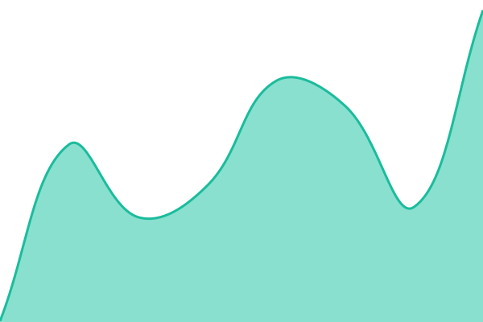

# [📈 Live Status](https://craighulme.github.io/uptime): <!--live status--> **🟩 All systems operational**

This repository contains the open-source uptime monitor and status page for [Craig](craighulme), powered by [Upptime](https://github.com/upptime/upptime).

With [Upptime](https://upptime.js.org), you can get your own unlimited and free uptime monitor and status page, powered entirely by a GitHub repository. We use [Issues](https://github.com/craighulme/uptime/issues) as incident reports, [Actions](https://github.com/craighulme/uptime/actions) as uptime monitors, and [Pages](https://craighulme.github.io/uptime) for the status page.

<!--start: status pages-->
<!-- This summary is generated by Upptime (https://github.com/upptime/upptime) -->
<!-- Do not edit this manually, your changes will be overwritten -->
<!-- prettier-ignore -->
| URL | Status | History | Response Time | Uptime |
| --- | ------ | ------- | ------------- | ------ |
|  [Core — QuackDuck API Database](https://quackduck.dev/api/health) | 🟩 Up | [core-quack-duck-api-database.yml](https://github.com/craighulme/uptime/commits/HEAD/history/core-quack-duck-api-database.yml) | 

 146ms
     
 | 

<a href="https://craighulme.github.io/uptime/history/core-quack-duck-api-database">12.22%</a>
    

|  [Core — QuackDuck API Layer](https://quackduck.dev/api/health) | 🟩 Up | [core-quack-duck-api-layer.yml](https://github.com/craighulme/uptime/commits/HEAD/history/core-quack-duck-api-layer.yml) | 

 78ms
     
 | 

<a href="https://craighulme.github.io/uptime/history/core-quack-duck-api-layer">12.22%</a>
    

|  [Infra — QuackDuck Site Host (Vercel)](https://www.vercel-status.com/) | 🟩 Up | [infra-quack-duck-site-host-vercel.yml](https://github.com/craighulme/uptime/commits/HEAD/history/infra-quack-duck-site-host-vercel.yml) | 

 179ms
     
 | 

<a href="https://craighulme.github.io/uptime/history/infra-quack-duck-site-host-vercel">95.96%</a>
    

|  [External — DeadZone Store](https://deadzone.dev/store) | 🟩 Up | [external-dead-zone-store.yml](https://github.com/craighulme/uptime/commits/HEAD/history/external-dead-zone-store.yml) | 

 581ms
     
 | 

<a href="https://craighulme.github.io/uptime/history/external-dead-zone-store">100.00%</a>
    

<!--end: status pages-->

[**Visit our status website →**](https://craighulme.github.io/uptime)

## 📄 License

- Powered by: [Upptime](https://github.com/upptime/upptime)
- Code: [MIT](./LICENSE) © [Anand Chowdhary](https://anandchowdhary.com), supported by [Pabio](https://pabio.com)
- Data in the `./history` directory: [Open Database License](https://opendatacommons.org/licenses/odbl/1-0/)
